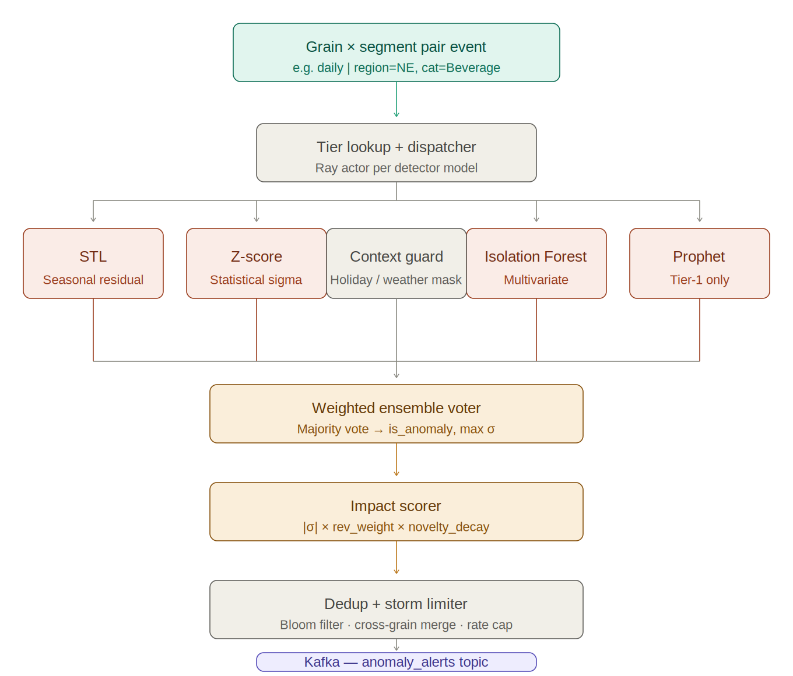
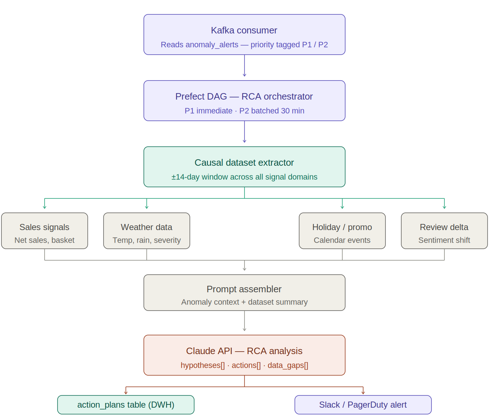
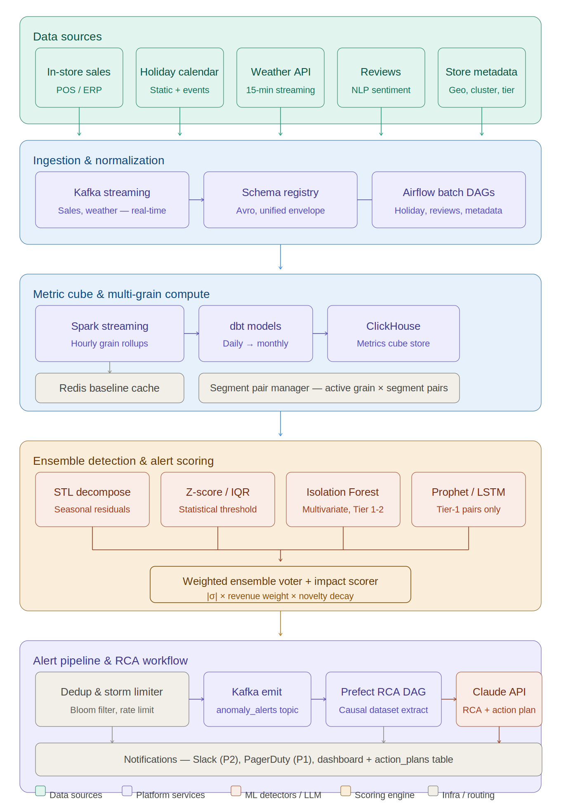

# Eyewear Anomaly Detection & RCA Automation

**Owner:** Data Platform
**Domain:** Spectacles & Eyewear Retail  
**Status:** Active
**Last Updated:** 2026-04-27

---

## What This System Does

This platform automatically detects unusual patterns in eyewear retail performance data and, when something significant is found, immediately generates a ranked, evidence-backed explanation of *why* it happened — without requiring a human to investigate.

**In plain terms:** if prescription frame sales in the Northeast dropped 4σ below the 28-day baseline on a Tuesday morning, this system catches it within 3 minutes, determines it is not explained by a public holiday or optometry clinic closure, and delivers a structured action plan to the right team before anyone opens a dashboard.

Critically for eyewear retail, the system understands the business calendar — FSA/HSA spending deadlines, back-to-school prescription rushes, UV-index-driven sunglass demand spikes, and insurance renewal cycles — and uses these signals to distinguish genuine operational problems from expected seasonal behaviour.

---

## Business Value

| Outcome | Metric |
|---|---|
| Time from anomaly to alert | < 3 minutes |
| Time from alert to action plan | < 10 minutes |
| False positive rate target | < 5% weekly |
| Retail signals monitored simultaneously | Up to 15,000 active segment pairs |
| Analyst hours saved per incident | ~2–4 hours of manual investigation |

The system monitors **four grains** (hourly, daily, weekly, monthly) across **five dimensions** (region, store cluster, product category, sales channel, customer cohort) — covering the full eyewear retail signal landscape without pre-enumerating every possible combination.

---

## Eyewear-Specific Data Signals

Beyond standard sales and weather feeds, the system ingests signals unique to the spectacles business:

| Signal | Examples | Why It Matters |
|---|---|---|
| Prescription fills | Frames dispensed, lens jobs completed, Rx renewals | Core revenue signal; delays indicate lab or supply issues |
| Product category | Optical frames, prescription sunglasses, contact lenses, reading glasses, accessories | Each has distinct seasonality and margin profile |
| Insurance & FSA calendar | Year-end FSA spend deadline, insurer benefit reset dates | Drives predictable demand surges; suppresses false anomalies |
| UV index feed | Daily UV forecast by store region | Directly correlates with sunglass walk-in traffic |
| Eye exam bookings | Optometrist appointment volume per store | Leading indicator: drops in bookings precede frame sales drops |
| Lab & supply events | Lens lab turnaround time, frame backorder status | Explains fulfilment anomalies independent of demand |
| Customer reviews | In-store fitting experience, optometrist ratings, lens quality | Sentiment drops are an early warning signal for store-level issues |
| Store type | Standalone optical, mall kiosk, optometry clinic, online, BOPIS | Each store type has a different demand pattern and margin structure |

---

## How It Works — Three Stages

### 1. Ingest & Normalize
All sources — POS transactions, lab fulfilment events, UV index feeds, FSA/insurance calendars, customer reviews, and store metadata — are normalized into a unified event schema. Real-time signals (in-store sales, contact lens subscription renewals) flow through Kafka. Slower signals (insurance benefit calendars, optometrist scheduling data, frame backorder feeds) arrive via Airflow batch pipelines.

### 2. Detect



*Per grain × segment pair: tier lookup → Ray dispatcher → parallel detectors → ensemble voter → impact scorer → dedup/storm limiter → Kafka emit.*

A **metric cube** in ClickHouse pre-computes every grain × segment combination, keeping query latency under 100ms. Four statistical models run in parallel on each data slice:

- **STL decomposition** — strips out trend and seasonality (e.g. weekly exam-day patterns, annual FSA surges) to expose true residual anomalies
- **Z-score / IQR** — fast baseline deviation check, runs across all 15,000 pairs
- **Isolation Forest** — catches multivariate outliers, such as a store where frame units are flat but average selling price has collapsed
- **Prophet** — probabilistic forecasting with eyewear-specific regressors (UV index, FSA deadline proximity), reserved for the top 1,000 highest-revenue pairs

A **weighted ensemble vote** combines all model signals. A built-in **context guard** suppresses alerts during known events — year-end FSA rush, back-to-school season, optometry conference closures, and severe weather — to prevent false alarms.

Detectors are tiered by store-category revenue rank so expensive models run only where they justify the cost.

### 3. Root Cause Analysis (RCA)



*End-to-end RCA automation: Kafka consumer → Prefect DAG → causal dataset extraction → prompt assembler → Claude API → action_plans table + Slack/PagerDuty.*

High-priority anomalies trigger an automated Prefect workflow that:

1. Pulls ±14 days of sales, UV index, insurance calendar, eye exam bookings, lab fulfilment times, and review sentiment in parallel
2. Assembles a structured prompt and calls the **Claude API**
3. Receives a machine-readable JSON response with ranked hypotheses, supporting evidence, and recommended actions
4. Writes the result to the `action_plans` table and routes to PagerDuty or Slack based on priority

**Example RCA hypotheses the system generates:**
- *"Contact lens subscription renewal drop — 0.82 likelihood. Insurance benefit reset on 2026-04-01 caused customers to delay orders awaiting new coverage confirmation. Evidence: renewal rate fell 34% in week of reset; mirrors pattern from 2025-04-01."*
- *"Prescription sunglass spike — 0.76 likelihood. UV index above 8 for 5 consecutive days in Southwest region. Evidence: walk-in traffic +41%, sunglass units +67%, no change in optical frame or contact lens sales."*
- *"Frame dispensing slowdown — 0.71 likelihood. Lab turnaround time increased from 4.2 to 7.8 days. Evidence: Rx orders placed but not fulfilled; no demand-side signal anomaly."*

---

## Eyewear Segment Dimensions

Segments are discovered from actual transaction traffic — not pre-enumerated — and capped at 15,000 active pairs ranked by revenue:

| Dimension | Values |
|---|---|
| Region | NE, SE, MW, SW, W |
| Store type | Standalone optical, mall kiosk, optometry clinic, outlet |
| Product category | Optical frames, prescription sunglasses, non-Rx sunglasses, contact lenses, reading glasses, lens coatings & accessories |
| Sales channel | In-store, online, BOPIS (buy online pick up in store), optometrist-referred |
| Customer cohort | Insurance-covered, FSA/HSA payer, self-pay, loyalty member, new customer, lapsed (>18 months) |

---

## Alert Priority & Routing

| Priority | Impact Score | Routing | RCA Triggered |
|---|---|---|---|
| P1 | ≥ 75 | PagerDuty + #alerts-critical | Yes, immediately |
| P2 | ≥ 40 | #alerts-eyewear (Slack) | Yes, batched every 30 min |
| P3 | < 40 | Dashboard only | No |

Storm protection prevents more than **3 alerts per segment per hour**, and a Bloom filter deduplicates repeated signals within a 1-hour rolling window.

---

## Architecture at a Glance



*Five horizontal zones: data sources → ingestion & normalization → metric cube & compute → ensemble detection & scoring → alert pipeline & RCA workflow.*

```
Data Sources               Ingestion              Compute               Detection              RCA
────────────────           ─────────              ───────               ─────────              ───
POS / Frame sales   ──►    Kafka (real-time) ──►  Spark Streaming  ──►  Tier Registry    ──►  Prefect Flow
Contact lens subs   ──►    Kafka (real-time) ──►  dbt rollups      ──►  Ray Dispatcher   ──►  6× Extractors
UV index feed       ──►    Kafka (polling)   ──►  ClickHouse cube  ──►  Ensemble Voter   ──►  Claude API
Lab fulfilment      ──►    Kafka (events)    ──►  Redis baselines  ──►  Impact Scorer    ──►  action_plans
Exam bookings       ──►    Airflow (daily)   ──►                   ──►  Dedup + Limiter  ──►  PagerDuty/Slack
Insurance calendar  ──►    Airflow (weekly)  ──►
Store & clinic meta ──►    Airflow (weekly)  ──►
```

---

## Technology Choices

| Concern | Tool | Why |
|---|---|---|
| Streaming | Apache Kafka (MSK) | Exactly-once delivery, replay capability |
| OLAP store | ClickHouse | Sub-100ms slice queries on 15K segment pairs |
| ML dispatch | Ray | Parallel detector actors with low overhead |
| Workflow | Prefect | Async RCA DAG with retry and observability |
| LLM analysis | Claude API | Structured JSON output, strong reasoning on domain context |
| Cache / rate limits | Redis Cluster | Baseline cache, tier registry, storm limiter |
| Observability | Datadog + OpenTelemetry | Pipeline latency, detection SLA tracking |

---

## Key Design Decisions

**FSA/insurance calendar as a first-class suppression signal.** Year-end FSA deadline surges and insurer benefit resets create demand patterns that look like anomalies but are entirely expected. The context guard treats these as suppression events, the same way it handles public holidays, preventing the system from alerting on predictable business cycles.

**UV index as a Prophet regressor for sunglasses.** Sunglass sales have a strong, near-real-time relationship with UV index. Including UV as an external regressor in Prophet (for Tier-1 sunglass segments) significantly improves forecast accuracy and reduces false positives during sunny-weather demand spikes.

**Segments discovered, not pre-enumerated.** The cross-product of region × store type × category × channel × cohort would exceed 1,000 combinations before accounting for cardinality within each dimension. Instead, active pairs are discovered from actual transaction traffic over 90 days and capped at 15,000 — ranked by revenue contribution.

**Tiered detector profiles.** Running Prophet on every segment would be cost-prohibitive. The top 1,000 pairs (high-revenue frame and contact lens segments) get four models; the remaining 10,000 get Z-score only. This delivers accuracy where revenue is highest.

**Ensemble voting, not single-model.** Any single model can produce spurious signals. Requiring a weighted majority across models drops the false positive rate significantly, which matters especially for eyewear where exam seasonality creates complex baseline shapes.

**LLM output is machine-readable.** Claude returns structured JSON directly. The `action_plans` table is queryable by downstream tools, allowing the ops team to filter by owning team, urgency, or product category without parsing free text.

---

## Repository Structure (Key Paths)

```
ingestion/          # Kafka producers/consumers, Airflow DAGs, Avro schemas
compute/            # Spark baseline jobs, dbt grain rollups, ClickHouse DDL
detection/          # Tier registry, Ray dispatcher, all detector models, ensemble voter
alerting/           # Bloom filter dedup, storm limiter, Kafka emitter
rca/                # Prefect flow, causal extractors, prompt builder, Claude client
config/             # Detector profiles, segment config, alert thresholds
infrastructure/     # Terraform (EKS/MSK/Redis), Helm chart, Dockerfiles
```

---

## Operational SLOs

| Metric | Target |
|---|---|
| Detection latency (event → alert) | < 3 min for daily grain |
| RCA time to action plan | < 10 min from P1 alert |
| Alert false positive rate | < 5% (measured weekly) |
| Active pair freshness | Refreshed nightly by 3am |
| Baseline staleness | Never older than 25 hours |
